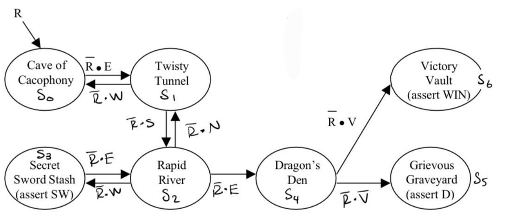
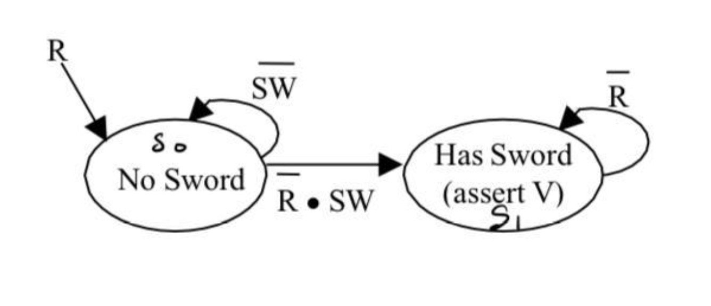
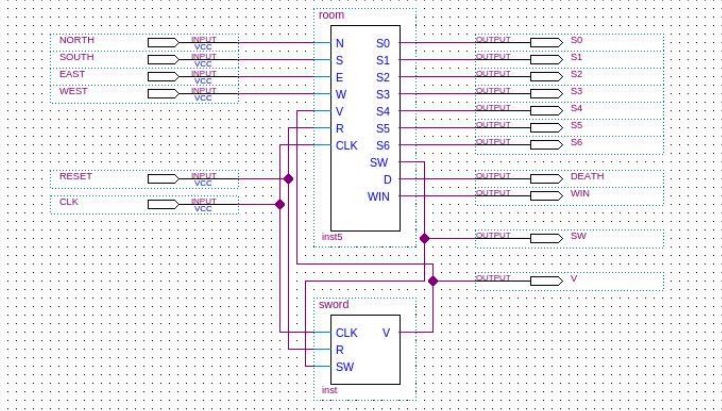
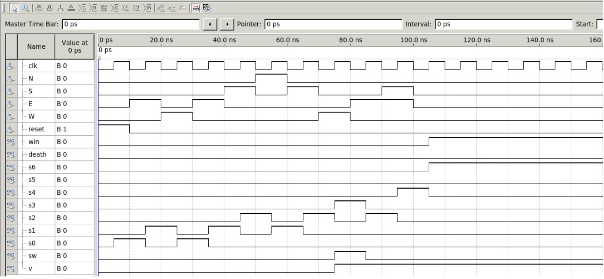
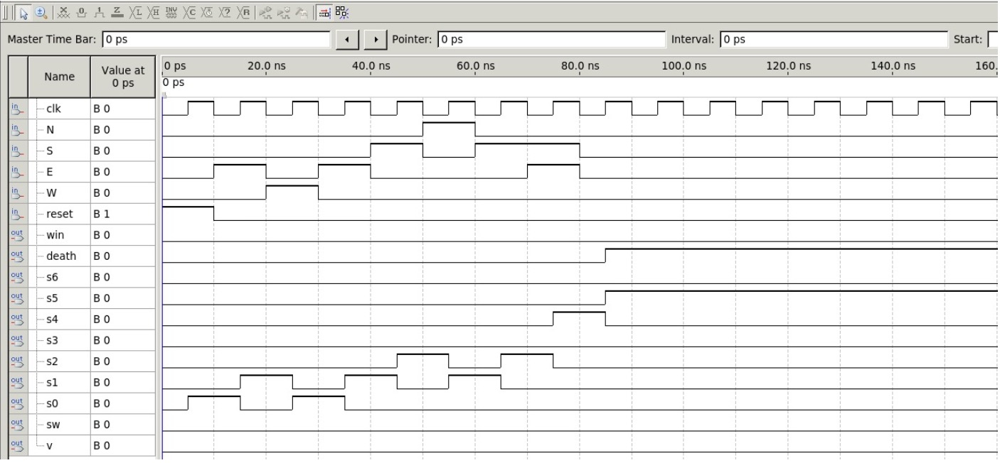
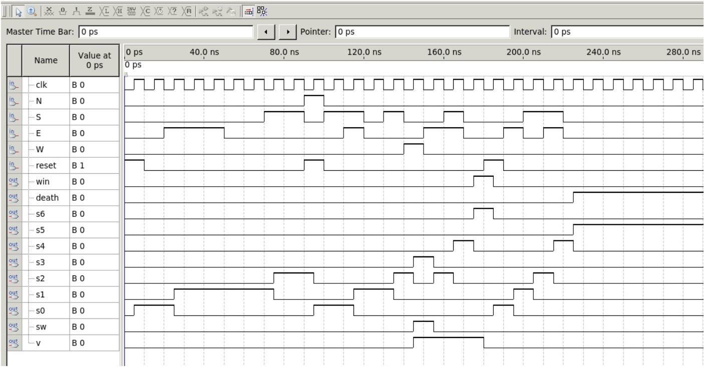

# Lab 5: Adventure Game 2 (SystemVerilog)

**Author:** Omar Hamoudeh  
**Course:** Digital System Design (14:332:437:04)  
**Date Submitted:** 10/12/24  

This repository contains my Lab 5 implementation of a digital adventure game using SystemVerilog, Quartus, and a Terasic FPGA board. Lab 5 builds on the foundational logic design work done in Lab 4, but with a major shift in approach.

In Lab 4, I designed the game by deriving Boolean equations for two finite state machines (FSMs)—the Room FSM and the Sword FSM—and then manually implemented the circuit using Quartus's schematic editor, placing and connecting each logic element by hand without writing code. This included creating hierarchical schematics and simulating the behavior using waveform files.

In contrast, Lab 5 involved directly writing the FSMs in SystemVerilog, using a modular coding approach. It introduced enhancements such as simultaneous directional inputs to reach the Dragon’s Den, and a hierarchical top-level game module that integrates both FSMs. The project was verified via simulation and deployed on FPGA hardware for real-time gameplay.

## 🔍 Project Overview

The objective is to build a game consisting of two communicating FSMs:
- A **Room FSM** that tracks the player's location
- A **Sword FSM** that tracks if the player has acquired the Vorpal Sword

The player must obtain the sword before entering the Dragon’s Den. If they do, they reach the **Victory Vault**. If not, they are sent to the **Grievous Graveyard**.

## 📁 Project Structure

| File             | Description                           |
|------------------|---------------------------------------|
| `d_ff.sv`        | D Flip-Flop module                    |
| `room.sv`        | Room FSM module                       |
| `sword.sv`       | Sword FSM module                      |
| `game.sv`        | Top-level game module                 |
| `Lab5.qpf/qsf`   | Quartus project files                 |
| `*.vwf`          | Simulation waveform files             |
| `.gitignore`     | Git tracking exclusions               |
| `images/`        | FSM diagrams, waveforms, and photos   |

## 🛠️ FSM Design

### 🗺️ Room FSM
Tracks room transitions using direction inputs (`n`, `s`, `e`, `w`) and handles room logic including entry into the Dragon's Den, Victory Vault, and Grievous Graveyard.

### ⚔️ Sword FSM
A simple FSM that transitions from "No Sword" to "Has Sword" upon entering the Secret Sword Stash. The `v` output persists until reset.

### 🧩 Hierarchical Design
The top-level `game` module instantiates both FSMs:

## 🖥️ Simulation Results

### ✅ Win Condition

Sequence: `E → W → E → S → N → S → W → E → (S + E)`  
Outcome: Reaches **Victory Vault**

---

### ❌ Lose Condition

Sequence: `E → W → E → S → N → S → (S + E)`  
Outcome: Enters **Grievous Graveyard**

---

### 🔁 Extra Case (Reset + Mixed Outcome)

Includes game resets, sword acquisition, and both win/lose transitions.

## 🔌 Pin Assignments

| Signal            | FPGA Pin | Output/Input | Description                |
|------------------|----------|--------------|----------------------------|
| `S0`             | H15      | Output       | Cave of Cacophony          |
| `S1`             | G16      | Output       | Twisty Tunnel              |
| `S2`             | G15      | Output       | Rapid River                |
| `S3`             | F15      | Output       | Secret Sword Stash         |
| `S4`             | H17      | Output       | Dragon's Den               |
| `S5`             | J16      | Output       | Grievous Graveyard         |
| `S6`             | H16      | Output       | Victory Vault              |
| `v`              | J15      | Output       | Has Sword Indicator        |
| `d` (dead)       | G17      | Output       | Death Indicator            |
| `sw`             | AF19     | Output       | Sword Detected             |
| `win`            | AE18     | Output       | Game Won Indicator         |
| `clk`            | Y2       | Input        | 50 MHz Onboard Clock       |
| `n`              | Y23      | Input        | Direction - North          |
| `e`              | Y24      | Input        | Direction - East           |
| `s`              | AA22     | Input        | Direction - South          |
| `w`              | AA23     | Input        | Direction - West           |
| `reset`          | AA24     | Input        | System Reset               |

---

> Created for Rutgers University, Fall 2024 — Digital System Design Lab 5
